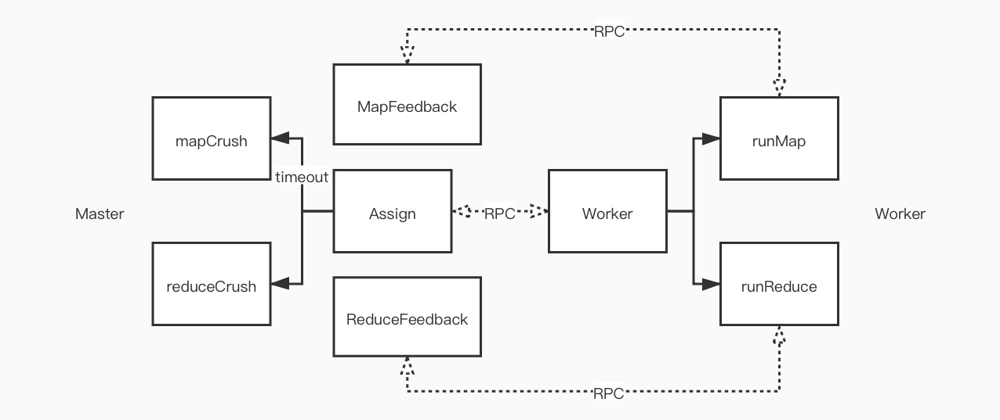

# 实验要求
* worker 单方面的向 Master 发送消息；
* 如果一个 worker 没有在合理时间内（10s）完成任务就算故障；

# 流程


# 实现细节
Master 实现于 mr/master.go，由 main/mrmaster.go 驱动，通过命令行参数传入输入文件：
```go
// 分发给 woker 的任务
type Task struct {
	Phase   // 标注是 Map 还是 Reduce
	Misson
	R int   // Reduce 数量
}

type Master struct {
	mMisson []Misson   // 待分配到任务队列
	rMisson []Misson
	mTasks []taskState // 维护 woker 的状态
	rTasks []taskState
	mCompleted int     // woker 的完成数量
	rCompleted int
}

func (m *Master) Assign(_ *Task, t *Task) error {
	// ...
	if len(m.mMisson) > 0 {
    // ...
		// t.Id == t.Mission.Id
    // 保证同一个任务所对应的 task 在数组中的下标是一样的
		m.mTasks[t.Id] = taskState{false, timer}
		go m.mapCrush(t)
	} else if m.mapDone() && len(m.rMisson) > 0 {
		// ...
    // t.Id == t.Mission.Id
    // 保证同一个任务所对应的 task 在数组中的下标是一样的
		m.rTasks[t.Id] = taskState{false, timer}
		go m.reduceCrush(t)
	} else {
    // 通知 worker sleep 一会
		t.Phase = Idle
	}
	// ...
}

func MakeMaster(files []string, nReduce int) *Master {
	// ...
	m.mTasks = make([]taskState, len(files)) // 空间开足，之后 index 访问
	for i := range files {
    // 初始化 Mission.Id，和 task 数组下标对应上
		m.mMisson = append(m.mMisson, Misson{i, files[i:i+1]})
  }
	m.rTasks = make([]taskState, nReduce)   // 空间开足，之后 index 访问
	for i := 0; i < nReduce; i++ {
    // 初始化 Mission.Id，和 task 数组下标对应上
		m.rMisson = append(m.rMisson, Misson{i, nil})
	}
	// ...
}
```
因为`Mission.Id`和`taskState`数组是完全对应的，所以可以保证 worker 超时后将任务分配给别的 worker 是安全的，如果同时接到来自不同 worker 对同一个任务的反馈，只会被确认一次
