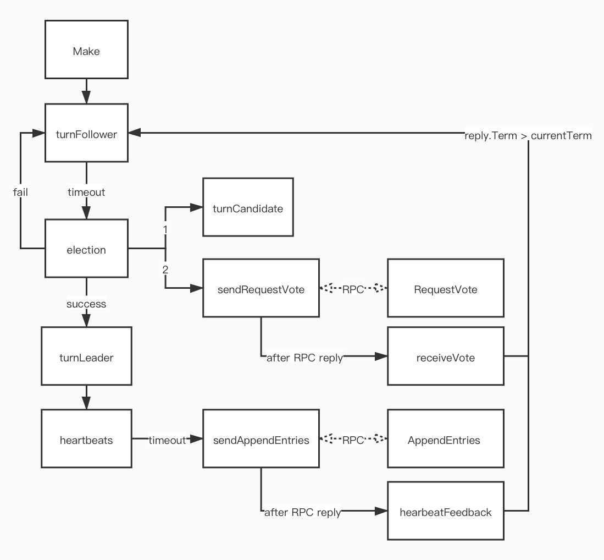

# 实验要求
* 每个节点在 command committed 后都应该 apply，对上层服务提供一写多读；
* 不用实现成员变更，成员构成是固定的；
* 在 Lab 3 再实现日志压缩；
* 心跳 RPC 频率不能超过每秒 10 次（100ms/次）；
* Leader 崩溃 5s 内需要选出一个新 Leader；
* 通过在循环中使用`time.Sleep`来实现 delay，不要使用`time.Timer`和`time.Ticker`；

# 快速恢复（Fast backup）
论文 5.3 末尾关于快速恢复的细节补充（6.824 Lecture 7 22:55）：

Follower 在日志冲突时返回：
* XTerm：冲突位置的 term；
* XIndex：term 为 XTerm 的第一条日志的 index；
* XLen：日志长度不够，此时 XTerm 为 -1，XLen 为日志长度；

Leader 处理：
* 若 XTerm 为 -1 则将 nextIndex 设置为 XLen + 1；
* 若存在 term 为 XTerm 的日志，将 nextIndex 设置为该 term 的最后一个日志；
* 否则，nextIndex 设置为 XIndex；

# RPC

* 每个 peer 是一个`*labrpc.ClientEnd`类型，提供了一个`Call`方法供`sendRequestVote`进行 RPC，`labrpc`包模拟了一种丢包网络；
* RPC 被实现为浅拷贝；
* 若要传递自定义类型，需要注册`labgob.Register(MyType{})`；

# 接口

Raft 向上层服务暴露的接口如下：
```go
// 启动当前 peer
// peers: 保存所有 peer（包括当前），所有 peer 上数组顺序相同
// me: 当前 peer 的 index
// persister: 当前 peer 保存持久状态的地方
// applyCh: 通知 service apply command 的 channel
rf := Make(peers, me, persister, applyCh)

// 向 Raft 发送 command（应立即返回）
rf.Start(command interface{}) (index, term, isleader)

// 获取 Raft 当前 term，并且反馈当前 peer 是否为 leader
rf.GetState() (term, isLeader)

// 关闭当前 peer
rf.Kill()

// 发送给 applyCh 的 meesage 类型
type ApplyMsg
```
由于每个 peer 中`peers`是固定的，peer 和 Raft 的关系不是“加入与否”的关系，而是“启动与否”的关系，当一个 peer 启动后 leader 会感知到然后向其发送心跳，所以 Raft 启动时不涉及成员变更的问题

# 流程


# 实现细节

## 计时器
为了能异步的将计时器安全重置，将计时器的时钟变量设置为原子变量（通过`sync/atomic`包装）。计时器实现所涉及的细节：
```go
// bias: 每次 timeout 的随机扰动范围
func newTick(timeout int, bias int, handler func()) *ticker {
	t := &ticker{}
	t.stopCh = make(chan struct{}, 1) // 容量为 1 才能让 stop 先于 beginTick，否则会死锁
	t.startCh = make(chan struct{})
  t.handler = handler
	t.timeout = timeout
	t.bias = bias
	t.stop() // 先 stop 再调用 beginTick
	go t.beginTick()
	return t
}

func (t *ticker) stop() {
	if !t.stoped {
		t.stopCh <- struct{}{}
		t.stoped = true // 防止对 stop 的重复调用引起 stopCh 阻塞
	}
}

func (t *ticker) start() {
	if t.stoped { 
		t.startCh <- struct{}{}
		t.stoped = false // 防止对 start 的重复调用引起 startCh 阻塞
	}
}

// 提供能在开启定时器时立马先调用一次 handler 的方法（如 heartbeat 有此需求）
func (t *ticker) trigger() {
	t.now.set(t.timeout + t.bias)
	t.start()
}
```

## 初始化
```go
func Make(peers []*labrpc.ClientEnd, me int,
	persister *Persister, applyCh chan ApplyMsg) *Raft {
  // ...
	rf.nextIndex = make([]int, len(peers))  // 一开始给足空间，以便之后可以直接 index 访问
	rf.matchIndex = make([]int, len(peers))
  // Part C 部分测试对选举超时敏感，当过不去时可以适当增加超时时间
	rf.electionTick = newTick(500, 150, rf.election, false) // 选举存在 150ms 随机扰动
	rf.heartbeatTick = newTick(100, 0, rf.heartbeats, true)  // heartbeats 调用优先于计时
	
  // ...
  // 在 index 0 处填充一个空日志，以便作为 PrevLog
	if len(rf.log) == 0 {
		rf.log = append(rf.log, LogEntries{nil, 0})
	}
	// ...
}
```

## 添加日志
```go
func (rf *Raft) Start(command interface{}) (int, int, bool) {
  // ...
	// 立马将新日志同步出去，提升单个请求的响应速度
	rf.heartbeatTick.trigger()
	// ...
}
```

## 选举
```go
func (rf *Raft) election() {
  // ...
  // 如果只有一个节点，直接成为 leader
	if len(rf.peers) == 1 {
		rf.turnLeader()
		return
	}
	
  // ...
	for peer := range rf.peers {
    // ...
    // 因为异步，args, reply 每次都重新创建，避免共享
		args := RequestVoteArgs {
			rf.currentTerm,
			rf.me,
			lastLogIndex,
			lastLogTerm,
		}
		reply := RequestVoteReply{}
		
		// 由于所依赖的 RPC 非异步，所以以异步的方式调用
		go rf.sendRequestVote(peer, &args, &reply)
	}
}
```
```go
func (rf *Raft) RequestVote(args *RequestVoteArgs, reply *RequestVoteReply) {
	// 如果该 peer 已经 dead，则不再参与投票
	if rf.killed() {
		return
	}
	// ...
}
```
```go
func (rf *Raft) receiveVote(peer int, args *RequestVoteArgs, reply *RequestVoteReply) {
	// 如果该 peer 已经 dead，则忽略
  if rf.killed() {
		return
	}
	
  // ...
  // 消息可能乱序，只处理当前任期的来票
	if rf.state != candidate || args.Term != rf.currentTerm {
		return
	}
	// ...
}
```

## 日志同步
```go
func (rf *Raft) heartbeats() {
	// ...
  // 先检查并更新 commitIndex 再发送心跳
	rf.checkCommit()
	
	for peer := range rf.peers {
		// ...
    // 因为异步，args, reply 每次都重新创建，避免共享
		args := AppendEntriesArgs {
			Term: rf.currentTerm,
			LeaderId: rf.me,
			PrevLogIndex: rf.nextIndex[peer] - 1,
			PrevLogTerm: rf.log[rf.nextIndex[peer] - 1].Term,
			LeaderCommit: rf.commitIndex,
		}
		reply := AppendEntriesReply{}
		
		if len(rf.log) > rf.nextIndex[peer] {
      // 已经 match 上才开始发日志，以免浪费带宽
			if rf.matchIndex[peer] > 0 || args.PrevLogIndex == 0 {
				args.Entries = rf.log[rf.nextIndex[peer]:]
			}
			rf.nextIndex[peer]++
		}
		
    // 由于所依赖的 RPC 非异步，所以以异步的方式调用
		go rf.sendAppendEntries(peer, &args, &reply)
	}
}
```

```go
func (rf *Raft) AppendEntries(args *AppendEntriesArgs, reply *AppendEntriesReply) {
	// 如果该 peer 已经 dead，则忽略
  if rf.killed() {
		return
	}
	// ...
}
```

```go
func (rf *Raft) hearbeatFeedback(peer int, args *AppendEntriesArgs, reply *AppendEntriesReply) {
  // 如果该 peer 已经 dead，则忽略
	if rf.killed() {
		return
	}
	
  // ...
  // 消息可能乱序，只处理当前任期的来票
	if rf.state != leader || args.Term != rf.currentTerm {
		return
	}
	
	if reply.Success {
		// ...
    // 每次收到后都检查一下是否可提交，而非定时或延迟检查，提升单个请求的响应速度
    if rf.matchIndex[peer] > rf.commitIndex {
			rf.checkCommit()
		}
	} else {
		rf.matchIndex[peer] = 0 // 应该重置 match
		// ...
		args.Entries = nil // 取消日志的携带
		// 立刻重试
		go rf.sendAppendEntries(peer, args, reply)
	}
}
```