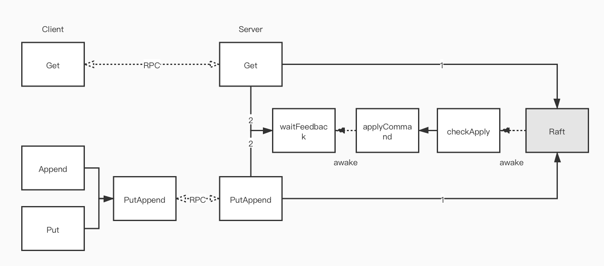
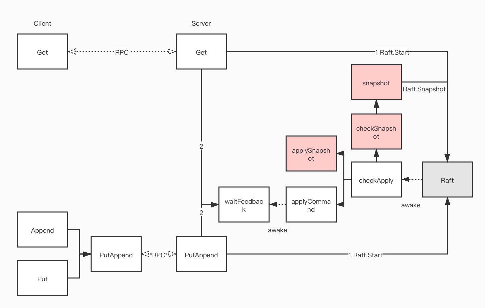
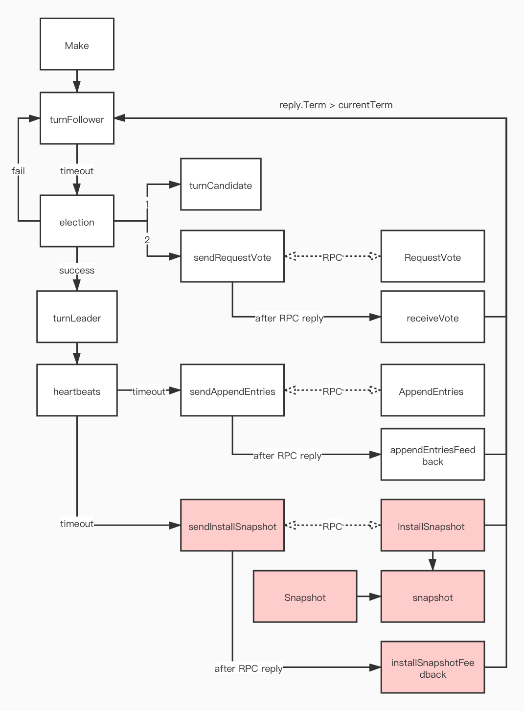

# K/V Server（Part A）

## 实验要求
* key 和 value 都是字符串；
* 服务支持三种操作：
	* `Put(key, value)`：替换`key`对应的`value`；
	* `Append(key, arg)`：将`arg`附加到`key`对应到`value`，如果不存在则等同于`Put`；
	* `Get(key)`：获取`key`对应的`value`，如果不存在返回空串；
* 执行一个操作前，需要确保之前都操作都已经落实了；
* 如果一个操作成功被应用，则通知客户端，否则向客户端报告一个错误，客户端应该重试其他服务器；
* 服务器之间不应该直接通信，只能通过 Raft 交换信息；
* 可以不实现论文 Section 8 中关于只读操作不写 log 的优化，把 Get 也写 log，最终收到  Raft apply 响应时说明已经取得了大多数，此时就避免了读脏数据的可能；
* 可以不实现服务器主动返回 leader，而在客户端对服务器遍历来寻找 leader；
* 可能出现这样的情况：当请求操作后，对应的服务器失去领导，新的 leader 接受了其他客户端的操作并提交，原来的服务器将新 leader 反馈的提交应用了，从而造成请求和响应不一致。可以在响应时判断服务器的任期是否变更，或者检查所响应的操作是否和请求对应上；
* 可以在客户端中记录最后通信的 leader，下次通信时优先考虑，从而节约寻找 leader 的时间；
* 当发生分区时，允许服务器和客户端无限期等待，直到分区恢复；
* Your scheme for duplicate detection should free server memory quickly, for example by having each RPC imply that the client has seen the reply for its previous RPC. It's OK to assume that a client will make only one call into a Clerk at a time？？？

## 流程


## 实现细节

### Client

避免同一个操作被执行多次的策略：为每个客户端设置一个唯一 Id，同时每个命令也有一个唯一 Id，由于单个客户端的请求是串行的，服务端只需要记录每个客户端最后执行的命令 Id 即可。设客户端数量为 $N$，服务器执行的总命令数量为 $M$，可知 $M \gg N$，采用这种策略可以将空间复杂度从 $O(M)$ 降为 $O(N)$

```go
func (ck *Clerk) Get(key string) string {
  // ...
	for i := 0; i < nServers; i++ {
      // 因为 [reason0]，需要为每次调用都新建 args, reply
			args := GetArgs{key} // 因为 Get 不更改状态，不用确保只执行一次，所以不绑定唯一 Id
			reply := GetReply{}
			ck.servers[ck.leader].Call("KVServer.Get", &args, &reply)
			// ...
		}
		// ...
}
```

### Server

由于只有 Leader 会接受用户请求，而 Follower 也需要同步状态，所以对 Raft 返回的 Command 进行 apply 应该作为一个后台 goroutine 自动循环 apply

调用 Raft 接口的 goroutine[0] 不能有阻塞 apply goroutine[1] 的风险，这样会导致：goroutine[0] 等待 Raft 返回，Raft 等待 goroutine[1] 读取 channel，goroutine[1] 被 goroutine[0] 阻塞，最终死锁

```go
func (kv *KVServer) applyCommand(op Op) {
	// ...
  // 不是所有的命令都需要 feedback，如 Follower 只是单纯 apply 而不和用户交互
	if kv.applyFeedback[op.OpId] != nil {
		kv.applyFeedback[op.OpId]() // awake waitFeedback
	}
}

func (kv *KVServer) waitFeedback(ch chan struct{}, timeout int) bool {
	select {
		case <- ch:
			return true
    // 以免这个请求最终没能成功，永远不 feedback
		case <- time.After(time.Duration(timeout) * time.Millisecond):
			return false
	}
}

func (kv *KVServer) Get(args *GetArgs, reply *GetReply) {
	// 为 Get 绑定唯一 Id 的目的在于注册回调
	opId := nrand()
	
  // 可能 feedback 时 waitFeedback 已经超时返回，没有继续监听 channel 了
  // 容量设置为 1，避免 feedback 因此阻塞
	feedbackCh := make(chan struct{}, 1)
	kv.registerFeedback(feedbackCh, opId, func() {
    // 将 reply 的更新放在 feedback
    // 可能 waitFeedback 超时返回了，但 reply 仍被更新 [reason0]
		reply.Value = kv.kv[args.Key]
	})
	defer kv.cancelFeedback(opId) // 避免影响 waitFeedback 超时返回了，仍然执行 feedback
	
  // ...
  // 需要优先于 Start 注册 feedback，以免 applyCommand 时 applyFeedback[OpId] == nil
  // 不能带着锁调 Start，避免死锁，因为 apply goroutine 需要锁
	kv.rf.Start(op)
  // ...
}
```

# Snapshot（Part B）

## 实验要求

* `maxraftstate`为创建快照的 Raft 日志大小阈值，如果为 -1 则无需创建快照，通过`persister.RaftStateSize()`获取 Raft 日志大小；
* K/V Server 通知 Raft 使用`persister.SaveStateAndSnapshot()`同时保存 Raft 状态和快照，以使得日志的删除与快照的存储作为一个原子操作；
* 使用`persister.ReadSnapshot()`来读取最新的快照；
* Your kvserver must be able to detect duplicated operations in the log across checkpoints, so any state you are using to detect them must be included in the snapshots.？？？
* 允许在单个 InstallSnapshot RPC 中发送整个快照代替论文中的分块发送；

## 流程
K/V Server：


Raft：


## 实现细节

### Server

检查 Raft 日志大小的时机应该是 apply Command 后，因为定时检查无法适应 Raft 日志增长速度，可能在两次检查间有大量 Raft 日志写入，而 apply Command 的速度与 Raft 日志的写入速度是相关的

为了防止阻塞 apply goroutine 造成死锁，不能在 apply goroutine 直接调用 Raft 接口进行 Snapshot，应该开启一个后台 snapshot goroutine 待命

```go
type KVServer struct {
	// ...
  // 最后一次 apply Command 在 Raft 日志的 index
  // 在 Snapshot 时传给 Raft 作 lastIncludedIndex
	nowIndex int
  // ...
}

func (kv *KVServer) snapshot() {
	for {
    // 先阻塞，刚启动时 nowIndex 未初始化
		<- kv.snapshotCh
		
		for kv.maxraftstate > 0 &&
		    kv.persister.RaftStateSize() >= kv.maxraftstate {
			kv.mu.Lock()
			snapshot := kv.genSnapshot()
			lastIncludedIndex := kv.nowIndex
			kv.mu.Unlock() // 不能带着锁调用 Raft.Snapshot，避免死锁
			
			kv.rf.Snapshot(lastIncludedIndex, snapshot)
		}
	}
}

func (kv *KVServer) checkSnapshot() {
	select {
  // 避免 apply goroutine 调用该函数而阻塞
	case kv.snapshotCh <- struct{}{}:
	default: // non-block
	}
}

func StartKVServer(servers []*labrpc.ClientEnd, me int, persister *raft.Persister, maxraftstate int) *KVServer {
	// ...
  // 因为通知发送为非阻塞，为了不错过通知，需要设置容量为 1
	kv.snapshotCh = make(chan struct{}, 1)
	// ...
}

```


### Raft

```go
func (rf *Raft) snapshot(lastIncludedIndex, lastIncludedTerm int, snapshot []byte) {
  // 该函数可能被 InstallSnapshot 调，不加锁
  
  // index 0 位置存放 lastIncludedIndex, lastIncludedTerm
  // 作为 Raft 状态持久化，而不持久化到 Snapshot
  // 可以方便的作 PrevLogIndex, lastIncludedTerm
	if lastIncludedIndex > rf.lastLogIndex() {
		rf.log = []LogEntries{LogEntries{nil, lastIncludedTerm, lastIncludedIndex}}
	} else {
		rf.log = rf.log[rf.logi(lastIncludedIndex):]
	}
  // ...
}

func (rf *Raft) Snapshot(lastIncludedIndex int, snapshot []byte) {
	rf.mu.Lock() // 在调用 snapshot 前加锁
	defer rf.mu.Unlock()
	
  // Server 触发 Snapshot 时，已经因收到 InstallSnapshot RPC 被 snapshot 过了
	if lastIncludedIndex <= rf.lastIncludedIndex() ||
     // Server 触发 Snapshot 时，日志可能已经因收到 AppendEntries RPC 被截断了
	   lastIncludedIndex > rf.lastLogIndex() {
		return
	}
	
	rf.snapshot(lastIncludedIndex, rf.log[rf.logi(lastIncludedIndex)].Term, snapshot)
}

func (rf *Raft) AppendEntries(args *AppendEntriesArgs, reply *AppendEntriesReply) {
  // ...
	if args.PrevLogIndex > rf.lastLogIndex() ||
     // 因延迟，PrevLogIndex 可能落在 Snapshot 过的日志范围
	   (rf.logi(args.PrevLogIndex) > 0 &&
	   rf.log[rf.logi(args.PrevLogIndex)].Term != args.PrevLogTerm) {
		reply.Success = false
		// ...
	}
	
  // 当 PrevLogIndex 落在 Snapshot 过的日志范围时，跳过这些部分
	i := max(rf.logi(args.PrevLogIndex + 1), 1)
	j := min(max(1 - rf.logi(args.PrevLogIndex + 1), 0),
	         len(args.Entries))
	rf.log = rf.log[:i]
	rf.log = append(rf.log, args.Entries[j:]...)
	
  // ...
  for i := rf.commitIndex + 1;
      i <= newCommitIndex;
      i++ {
      // 重启后 commitIndex 为 0，可能落在 snapshot 过的日志范围
      if rf.logi(i) <= 0 {
        // 可能 snapshot 由 InstallSnapshot 触发，但在通知 Server apply 之前就崩溃了
        // 所以应该重新通知 Server apply snapshot，而不跳过
        rf.applyCh <- ApplyMsg{false, nil, rf.lastIncludedIndex()}
        i = rf.lastIncludedIndex()
        continue
	    }

    rf.applyCh <- ApplyMsg{true, rf.log[rf.logi(i)].Command, i}
  }
	// ...
}

func (rf *Raft) InstallSnapshot(args *InstallSnapshotArgs, reply *InstallSnapshotReply) {
	// ...
  // 因为延迟，收到 InstallSnapshot RPC 时可能已经 snapshot 过了
	if args.LastIncludedIndex < rf.lastIncludedIndex() {
		return
	}
	
	rf.snapshot(args.LastIncludedIndex, args.LastIncludedTerm, args.Data)
}

func (rf *Raft) checkCommit() {
	// ...
	for i := rf.commitIndex + 1; i <= matchIndex[half]; i++ {
    // 同之前
    if rf.logi(i) <= 0 {
      rf.applyCh <- ApplyMsg{false, nil, rf.lastIncludedIndex()}
      i = rf.lastIncludedIndex()
      continue
    }
    
    rf.applyCh <- ApplyMsg{true, rf.log[rf.logi(i)].Command, i}
	}
	// ...
}

func (rf *Raft) appendEntriesFeedback(peer int, args *AppendEntriesArgs, reply *AppendEntriesReply) {
	// 可能 nextIndex 最后会退到 Snapshot 过的日志范围
	if rf.nextIndex[peer] <= rf.lastIncludedIndex() {
		// ...
		go rf.sendInstallSnapshot(peer, &args, &reply)
		return
	}
	// ...
}
```

