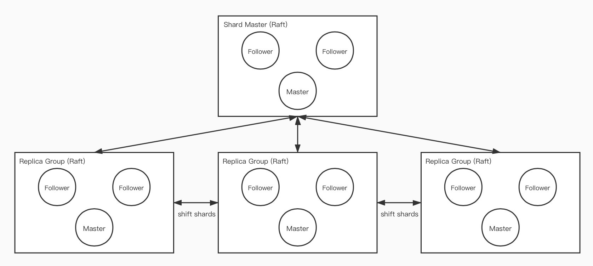
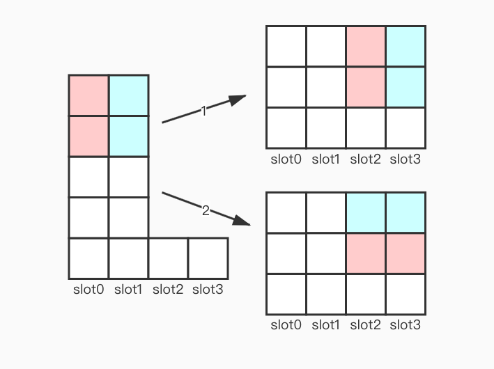
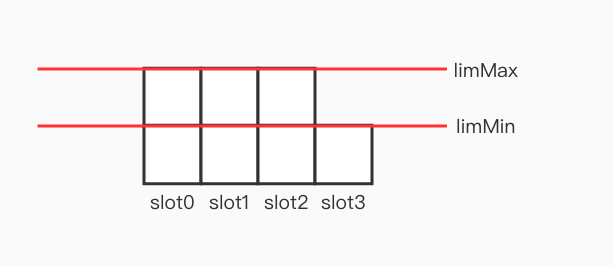
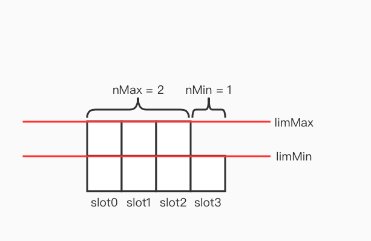

# 实验要求



* 每个 Replica Group 负责存储一组 K/V，通过 Raft 实现组内一致性；
* Shard Master 管理配置信息，决定如何分片，通过 Raft 实现容错；
* 客户端请求 Shard Master 来查询 Key 所在的 Replica Group，可以将配置信息存储在客户端本地，可直在请求失败时才重新获取配置；
* 分片需要在不同 Replica Group 之间移动，以实现 Replica Group 加入或离开集群时负载均衡；
* 负载均衡时，需要尽量少地移动分片；
* Shard Master 需要保留历史配置，不同的配置直接拥有唯一编号标示。第一个配置的编号为 0，不包含任何 Replica Group，所有的碎片都被分配到 GID 0（此时 GID 0 是无效的）；
* 分片的数量远多于 Replica Groups 数量，即每个 Replica Group 管理许多分片，以支持细粒度的负载转移；
* Shard Master 需要实现如下 RPC 接口：
	* `Join`：加入新 Replica Group；
	* `Leave`：将 Replica Group 从集群剔除；
	* `Move`：将分片移动到指定 Replica Group，单纯用于测试，之后的`Join`和`Leave`触发的负载均衡将覆盖`Move`的影响；
	* `Query`：查询特定编号的配置，如果参数为 -1 或大于最大编号，则返回最新配置；
* Replica Group 至少需要 100ms/次 的频率向 Shard Master 了解最新配置；
* 允许在迁移完分片后，不删除不再拥有的分片，这样可以简化服务的设计；
* 迁移分片时，允许直接发送整个数据库的数据，以简化传输逻辑；

# 实现细节

## Shard Master
逻辑流程与 Lab 3 的 kvraft 一致，将`Get`、`PutAppend`的处理换成了`Join`、`Leave`、`Move`、`Query`
```go
type groupSlot struct {
	gid int
  valid bool   // 如初始状态下的 gid 0 为 false
	shards []int
}

type ShardMaster struct {
	// ...
	slots []groupSlot // gid -> shards
  // ...
}

type Op struct {
	Op string
  // 由于 RPC 实现限制，不能实现为 args interface{} + 类型断言
	JoinServers map[int][]string
	LeaveGIDs []int
	MoveShard int
	MoveGID   int
	ClerkId int64
	OpId int64
}

func (sm *ShardMaster) join(servers map[int][]string) {
  // 从最新的 config 将内容拷贝出来，避免 config 之间共享底层结构
	shards := sm.lastedConfig().Shards
	groups := make(map[int][]string)
	for gid, servers := range sm.lastedConfig().Groups {
		groups[gid] = servers
	}
	
  // 将新 group 加入 slots
  // 对 slots 负载均衡
  // 基于 slots 更新 shard -> gid
  // 新建 config
}

func (sm *ShardMaster) leave(gids []int) {
  // ...
  // 将 leave 的 group 在 slots 中标记为 invalid
  // 对 slots 负载均衡
  // 基于 slots 更新 shard -> gid
  // 新建 config
}

func (sm *ShardMaster) move(shard, gid int) {
  // ...
	// 在 slots 中，将 shard 从源 group 删除
  // 在 slots 中，将 shard 加入目的 group
  // 对 slots 负载均衡
  // 基于 slots 更新 shard -> gid
  // 新建 config
}

func StartServer(servers []*labrpc.ClientEnd, me int, persister *raft.Persister) *ShardMaster {
	// ...
  // 初始化 slots，将所有 shards 绑定到 gid 0，并将其标记为 invalid
	var shards []int
	for shard := 0; shard < NShards; shard++ {
		shards = append(shards, shard)
	}
	sm.slots = append(sm.slots, groupSlot{0, false, shards})
	// ...
}
```
负载均衡策略：
* 为了尽可能少的转移分片，不应该以最大`slot`到最小`slot`的方式循环迭代转移（如图箭头 2，`slot0`、`slot1`都需要需要同时和`slot2`、`slot3`通信），而应该批量转移（如图箭头 1，`slot0`只需要和`slot2`通信，`slot1`只需要和`slot3`通信）；



* 负载均衡状态下的容量上限不是唯一值（如图），要确定每个`slot`需要转移（接受）多少分片，等价于，确定每个`slot`应该满足哪个容量上限。为了尽可能少的转移分片，应该让含有分片多的`slot`满足`limMax`，让含有分片少的`slot`满足`limMin`；



负载均衡实现：
1. 对`slots`排序，优先`valid == false`，`shards`多的；
2. 更新`slots`，将前面`invalid`的裁了；
3. 计算在负载均衡状态下的容量上限；
4. 令前的`nMax`个`slot`需满足`limMax`，后`nMin`个需满足`limMin`（如图）；
	* 将`invalid`中的分片转移到不足容量上限的`slot`；
	* 将超过容量上限分片转移到不足容量上限的`slot`；

