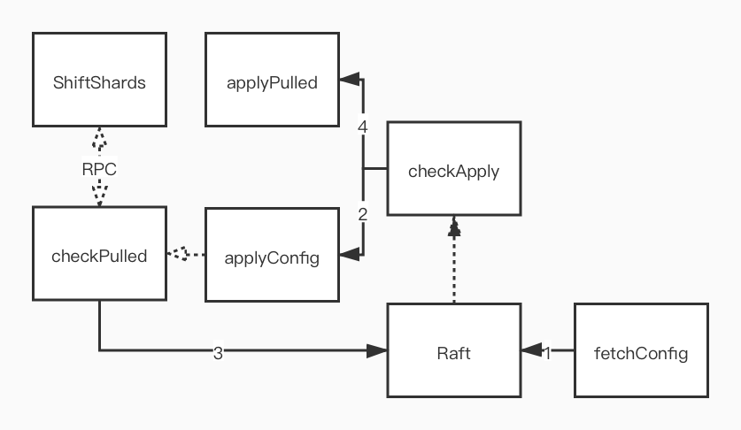

# 实验要求


* 每个 Replica Group 负责存储一组 K/V，通过 Raft 实现组内一致性；
* Shard Master 管理配置信息，决定如何分片，通过 Raft 实现容错；
* 客户端请求 Shard Master 来查询 Key 所在的 Replica Group，可以将配置信息存储在客户端本地，可直在请求失败时才重新获取配置；
* 分片需要在不同 Replica Group 之间移动，以实现 Replica Group 加入或离开集群时负载均衡；
* 负载均衡时，需要尽量少地移动分片；
* Shard Master 需要保留历史配置，不同的配置直接拥有唯一编号标示。第一个配置的编号为 0，不包含任何 Replica Group，所有的碎片都被分配到 GID 0（此时 GID 0 是无效的）；
* 分片的数量远多于 Replica Groups 数量，即每个 Replica Group 管理许多分片，以支持细粒度的负载转移；
* Shard Master 需要实现如下 RPC 接口：
	* `Join`：加入新 Replica Group；
	* `Leave`：将 Replica Group 从集群剔除；
	* `Move`：将分片移动到指定 Replica Group，单纯用于测试，之后的`Join`和`Leave`触发的负载均衡将覆盖`Move`的影响；
	* `Query`：查询特定编号的配置，如果参数为 -1 或大于最大编号，则返回最新配置；
* Replica Group 至少需要 100ms/次 的频率向 Shard Master 了解最新配置；
* 允许在迁移完分片后，不删除不再拥有的分片，这样可以简化服务的设计；
* 迁移分片时，允许直接发送整个数据库的数据，以简化传输逻辑；

# Shard Master
逻辑流程与 Lab 3 的 kvraft 一致，将`Get`、`PutAppend`的处理换成了`Join`、`Leave`、`Move`、`Query`
```go
type groupSlot struct {
	gid int
  valid bool   // 如初始状态下的 gid 0 为 false
	shards []int
}

type ShardMaster struct {
	// ...
	slots []groupSlot // gid -> shards
  // ...
}

func (sm *ShardMaster) join(servers map[int][]string) {
  // 从最新的 config 将内容拷贝出来，避免 config 之间共享底层结构
	shards := sm.lastedConfig().Shards
	groups := make(map[int][]string)
	for gid, servers := range sm.lastedConfig().Groups {
		groups[gid] = servers
	}
	
  // 将新 group 加入 slots
  // 对 slots 负载均衡
  // 基于 slots 更新 shard -> gid
  // 新建 config
}

func (sm *ShardMaster) leave(gids []int) {
  // ...
  // 将 leave 的 group 在 slots 中标记为 invalid
  // 对 slots 负载均衡
  // 基于 slots 更新 shard -> gid
  // 新建 config
}

func (sm *ShardMaster) move(shard, gid int) {
  // ...
	// 在 slots 中，将 shard 从源 group 删除
  // 在 slots 中，将 shard 加入目的 group
  // 对 slots 负载均衡
  // 基于 slots 更新 shard -> gid
  // 新建 config
}

func StartServer(servers []*labrpc.ClientEnd, me int, persister *raft.Persister) *ShardMaster {
	// ...
  // 初始化 slots，将所有 shards 绑定到 gid 0，并将其标记为 invalid
	var shards []int
	for shard := 0; shard < NShards; shard++ {
		shards = append(shards, shard)
	}
	sm.slots = append(sm.slots, groupSlot{0, false, shards})
	// ...
}
```
负载均衡策略：
* 为了尽可能少的转移分片，不应该以最大`slot`到最小`slot`的方式循环迭代转移（如图箭头 2，`slot0`、`slot1`都需要需要同时和`slot2`、`slot3`通信），而应该批量转移（如图箭头 1，`slot0`只需要和`slot2`通信，`slot1`只需要和`slot3`通信）；


* 负载均衡状态下的容量上限不是唯一值（如图），要确定每个`slot`需要转移（接受）多少分片，等价于，确定每个`slot`应该满足哪个容量上限。为了尽可能少的转移分片，应该让含有分片多的`slot`满足`limMax`，让含有分片少的`slot`满足`limMin`；


负载均衡实现：
1. 对`slots`排序，优先`valid == false`，`shards`多的；
2. 更新`slots`，将前面`invalid`的裁了；
4. 令前的`nMax`个`slot`需满足`limMax`，后`nMin`个需满足`limMin`（如图）；
	* 将`invalid`中的分片转移到不足容量上限的`slot`；
	* 将超过容量上限分片转移到不足容量上限的`slot`；


# Shift Shards

## 思路
* 为了避免重复请求，只由 Leader 向 Shard Master 请求配置，再使用 Raft 达成共识；
* 为了避免重复请求，只由 Leader 进行分片转移，再使用 Raft 达成共识；
* 应该单独开一个 goroutine 主动检查并进行分片转移，而非配置更新时被动触发，可能分片转移的结果没能在 Raft 达到共识，需要重试；
* 一次分片转移的完整过程为：从 Raft 中读取到配置更新，到 Raft 中读取到分片更新，在这期间应该停止对旧分片和新分片的操作，避免转移的结果覆盖操作；
* 不应该直接更新到最新的配置，而应该更新到下一任配置，预防出现这样的情况：
	1. 分片一开始在 A Group；
	2. 分片转移到 B Group；
	3. 分片转移到 C Group；
	
	C Group 直接从配置 1 更新到配置 3，从而只从 A Group 请求分片，丢失了 B Group 的更新；
* 应该拒绝将分片转移给配置比自己新的 Group，预防 A Group 还没更新配置，B Group 先更新并从 A Group 获取了分片，之后 A Group 执行的数据更新操作都没有转移到 B Group；
* 应该针对每个分片都维护一个“每个客户端最后执行的命令 Id”来避免操作重复，在转移分片的时候将该记录也转移，预防 A Group 执行完了操作但没向客户端反馈，接着将分片转移给 B Group，客户端继续向 B Group 发送重复请求；

## 流程



在 Lab 3 kvraft 的基础上实现，省略了 kvraft 的部分

## 实现细节
```go
func (kv *ShardKV) genSnapshot() []byte {
	// ...
  // 可能配置更新过程中会触发 snapshot
  e.Encode(kv.oldConfig)
	e.Encode(kv.shifting)
  // ...
}

func (kv *ShardKV) applyCommand(op Op) {
	// ...
  // 可能接受请求时还拥有分片，而执行请求时就失去了对分片的拥有，所以再次判断
	if kv.shifting || kv.config.Shards[key2shard(op.Key)] != kv.gid {
		return
	}
  // ...
}

func (kv *ShardKV) applyPulled(pulled Pulled) {
  // 第一个条件避免出现 Raft 日志为：【config】【pulled】...【pulled】
  // 中间 "..." 的操作被后面的【pulled】覆盖而丢失
  // [reason1] 第二个条件避免出现 Raft 日志为：【config1】【pulled1】【config2】【pulled1】
	// 【config2】还未完成分片转移，【pulled1】就会关闭 shifting 允许执行操作
	if !kv.shifting || pulled.ConfigNum != kv.config.Num {
		return
	}
	//...
  // 应该拷贝而非直接引用
  // 因为 kv.lastApplied 之后会修改，而 pulled 来自 Raft 日志
  // Raft 日志内容应该一旦写入就不再改变
	for _, shard := range pulled.Shards {
		for clerkId, opId := range pulled.LastApplied[shard] {
			kv.lastApplied[shard][clerkId] = opId
		}
	}
}

func (kv *ShardKV) ShiftShards(args *ShiftArgs, reply *ShiftReply) {
	// ...
  // 避免转移脏数据，只应该由 Leader 执行转移
  // 采用和 Get 操作一样的逻辑
	kv.registerFeedback(feedbackCh, opId, func() {
		reply.KV = make(map[string]string)
		for _, shard := range args.Shards {
			for k, v := range kv.kv {
				if key2shard(k) == shard {
					reply.KV[k] = v
          // 应该拷贝而非直接引用
          // 因为 kv.lastApplied 之后会修改，而 reply 作为 pulled 将存入 Raft 日志
          // Raft 日志内容应该一旦写入就不再改变
					reply.LastApplied[shard] = make(map[int64]int64)
					for clerkId, opId := range kv.lastApplied[shard] {
						reply.LastApplied[shard][clerkId] = opId
					}
				}
			}
		}
	})
  // ...
}

func (kv *ShardKV) checkPull() {
	for {
		// ...
		var pulled Pulled
		pulled.KV = make(map[string]string)
    // For [reasone1]
		pulled.ConfigNum = config.Num
    // ...
		
		for gid, shards := range tobePull {
			// ...
      // [reason0] 因为 Group 可能已经在新配置 Leave 了，所以从旧配置信息中获取 Servers
			servers := oldConfig.Groups[gid]
			// ...
		}
	}
}

func (kv *ShardKV) applyConfig(config shardmaster.Config) {
  // 第一个条件避免出现 Raft 日志为：【config1】【pulled1】...【config1】【pulled1】
  // 中间 "..." 的操作被后面的【pulled1】覆盖而丢失
  // 第二个条件避免出现 Raft 日志为：【config1】【config2】【pulled1】
  // 【config2】还未完成分片转移，【pulled1】就会关闭 shifting 允许执行操作
	if kv.config.Num >= config.Num || kv.shifting {
		return
	}
	
  // For [reason0]
	kv.oldConfig = kv.config
	// ...
}

func (kv *ShardKV) Get(args *GetArgs, reply *GetReply) {
	// ...
  kv.registerFeedback(feedbackCh, opId, func() {
    // 不应该在 Get 入口检查是否拥有分片
		// 避免节点已经不是 Leader 了，却因为没有更新配置以 ErrWrongGroup 拒绝请求
		if kv.shifting ||
		   kv.config.Shards[key2shard(args.Key)] != kv.gid {
			reply.Err = ErrWrongGroup
			return
		}
		reply.Value = kv.kv[args.Key]
		reply.Err = OK
	})
  // ...
}
```

## Challenge（TODO）
删除分片思路：
* 防止 Raft 日志重放时触发分片转移，分片转移后应该 Snapshot；
* Snapshot 结束后，向源 Group 发送一个 RPC 信号，通知其可以删除分片；

